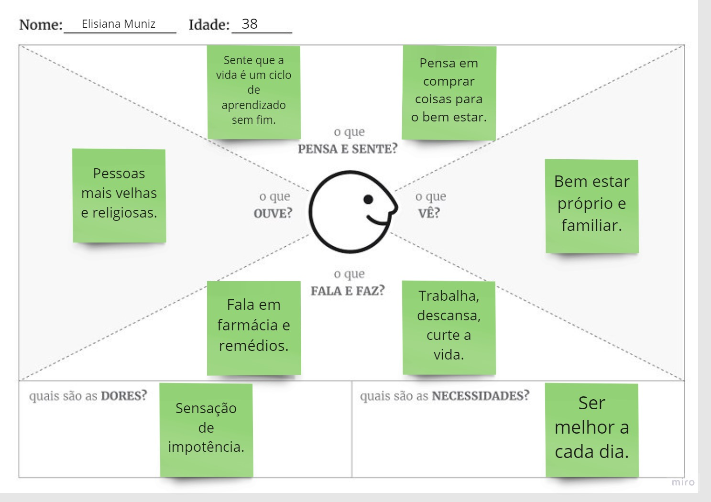
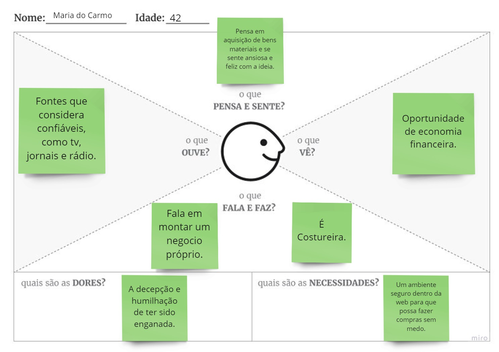
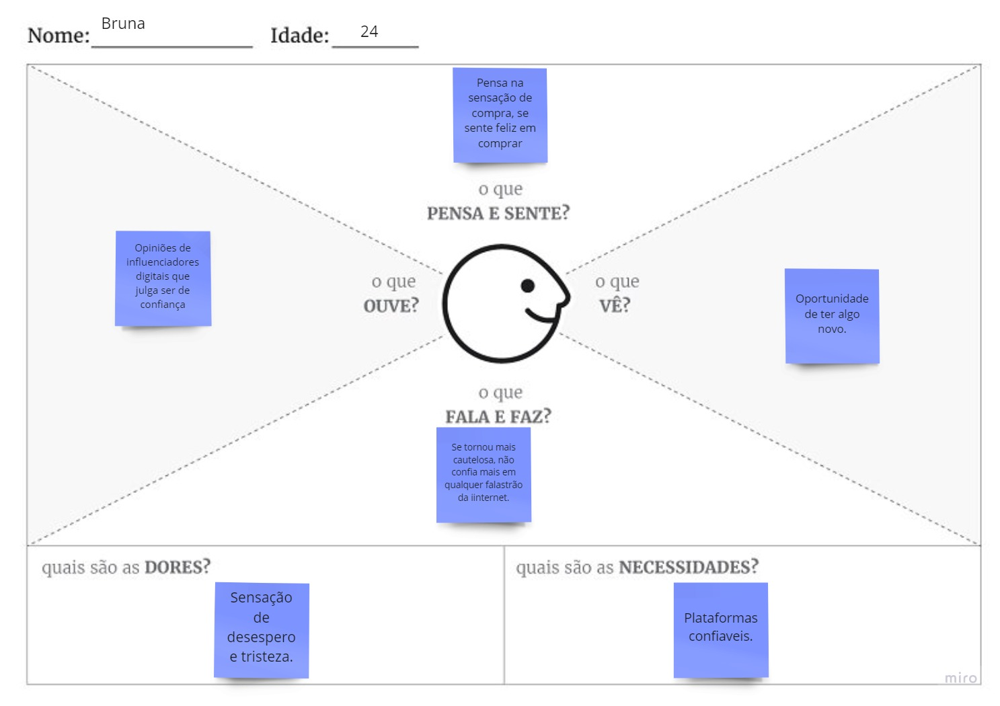

# Especificações Do Projeto

Pré-requisitos: <a href="1-Contexto.md"> Documentação de Contexto</a>

> Requisitos funcionais e não funcionais,
> restrições, 
> historias de usuario,
> personas.

## Personas

Elisiana Muniz de Azevedo tem 38 anos, é farmaceutica recém-formada.
Pensa em se desenvolver profissionalmente através da pós graduação.

Maria do Carmo tem 42 anos, é costureira atua a anos com isso.
Pensa em abrir um negocio proprio.

Bruna tem 24 anos, é youtuber.
Pensa em abrir um negocio proprio é continuar negocio digital que já da certo.

## Histórias de Usuários

Com base na análise das personas forma identificadas as seguintes histórias de usuários:

|EU COMO... `PERSONA`| QUERO/PRECISO ... `FUNCIONALIDADE` |PARA ... `MOTIVO/VALOR`                 |
|--------------------|------------------------------------|----------------------------------------|
| Usuário do sistema | Verificar por categoria sites seguros | Ter outras opções de compra segura. |
| Usuário do sistema | Digitar uma url e ver se é segura  | Ter certeza que esta comprando com seguranca |
| Administrador do sistema | Habilitar/Desabilitar cadastro de sites seguros | Site pode ter sido cadastrado sem ser realmente seguro |
| Administrador do sistema | Cadastrar novos sites | Incluir site na base de dados do sistema |
| Administrador do sistema | Excluir cadastros de sites | Remover site da base de dados do sistema |
| Administrador do sistema | Alterar cadastros de sites | Alterar site da base de dados do sistema |

Elisiana: Quero entrar em um site que eu me sinta segura ao comprar.
Maria do Carmo: Quero ter certeza que não estou entregando meus dados para alguem mal intencionado.
Bruna: Quero comprar e indicar para meus seguidores algo confiavel.

## Requisitos

As tabelas que se seguem apresentam os requisitos funcionais e não funcionais que detalham o escopo do projeto.

### Requisitos Funcionais

|ID    | Descrição do Requisito                                              | Prioridade |
|------|---------------------------------------------------------------------|------------|
|RF-001| Permitir que o usuario verifique pela url se um site é seguro       | ALTA       | 
|RF-002| Permitir que o usuario verifique pela categoria se um site é seguro | ALTA       |
|RF-003| Permitir que o administrador cadastre novos sites                   | MÉDIA      |
|RF-004| Permitir que o administrador altere cadastros ja existentes         | MÉDIA      |
|RF-005| Permitir que o administrador exclua cadastros ja existentes         | MÉDIA      |
|RF-006| Permitir que o administrador habilite/desabilite cadastros          | MÉDIA      |
|RF-007| Adimistrador deve esta logado para executar ações                   | MÉDIA      |
|RF-008| Url deve ser valida para verificação da mesma                       | MÉDIA      |

### Requisitos não Funcionais

|ID     | Descrição do Requisito                                            |Prioridade |
|-------|-------------------------------------------------------------------|-----------|
|RNF-001| O sistema deve ser responsivo para rodar em um dispositivos móvel | MÉDIA     | 
|RNF-002| O sistema responder em tempo maximo de 5s                         | MÉDIA     | 

## Restrições

O projeto está restrito pelos itens apresentados na tabela a seguir.

|ID| Restrição                                             |
|--|-------------------------------------------------------|
|01| O sistema não funciona sem internet                   |
|02| O sistema não funciona com url's invalidas            |
|03| Obrigatório preenchimento da URL                      |
