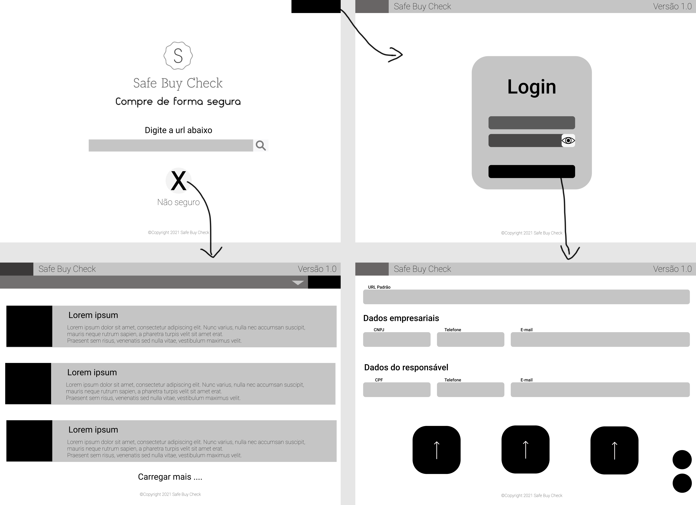
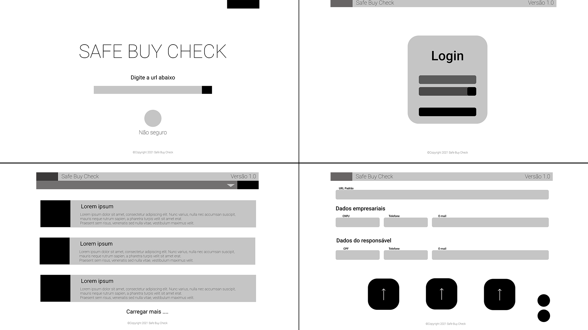

# Projeto de Interface

Pré-requisitos: <a href="2-Especificação.md"> Documentação de Especificação</a>

> Apresente as principais a interface da plataforma. Discuta como ela
> foi elaborada de forma a atender os requisitos funcionais, não
> funcionais e histórias de usuário abordados nas [Especificações do
> Projeto](2-Especificação.md).

## User Flow

> - Home > login
> - Home > sites seguros
> - Login > cadastro de sites
>
> **Links Úteis**:
> - [Figma](https://www.figma.com/file/SXR83Ntvgz95rg8PBQO8FH/Crimes-Ciberneticos?node-id=23%3A152)

## Wireframes

> Prototipo de baixa fidelidade das telas a serem desenvolvidas.
> 
> **Links Úteis**:
> - [Figma](https://www.figma.com/file/SXR83Ntvgz95rg8PBQO8FH/Crimes-Ciberneticos?node-id=0%3A1)
