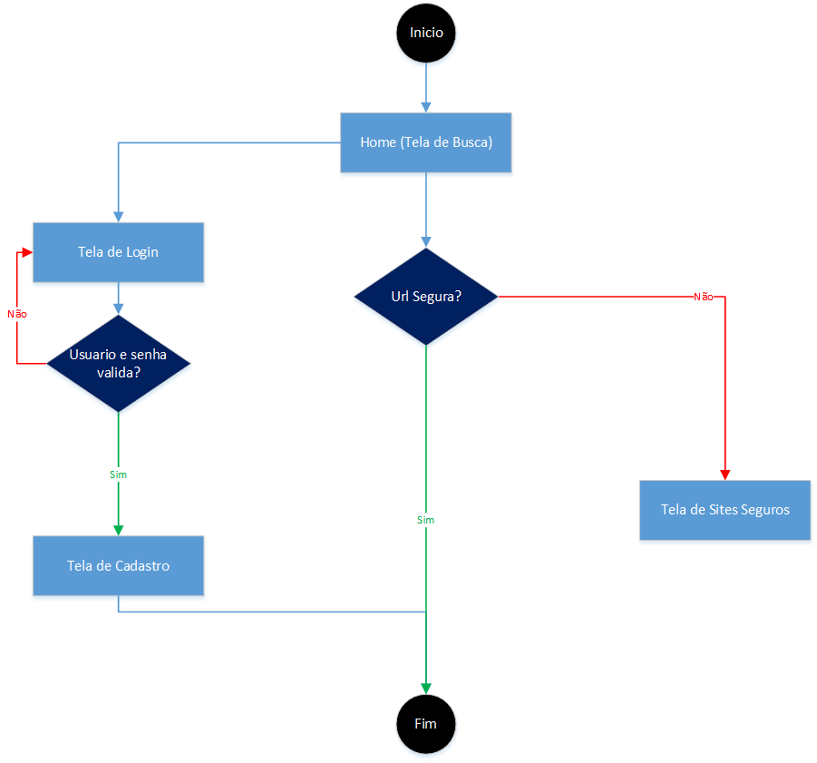
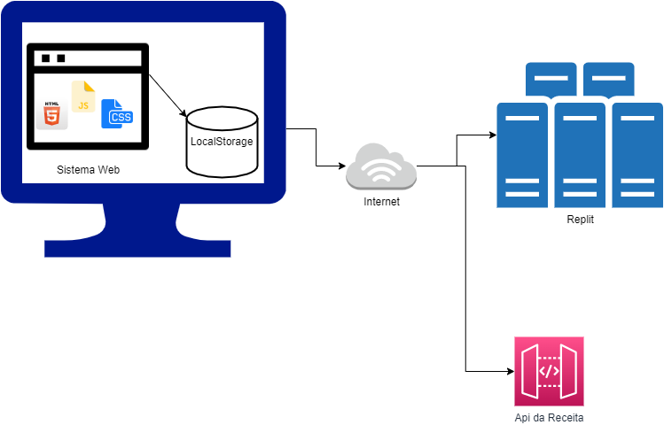
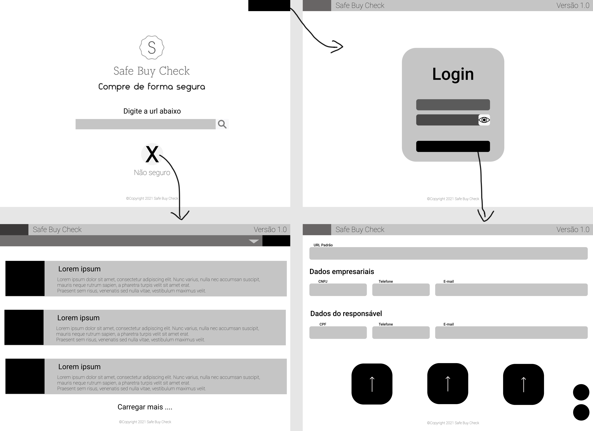

# Projeto da Solução

Pré-requisitos: <a href="4-Gestão-Configuração.md"> Ambiente e Ferramentas de Trabalho</a>

## Tecnologias Utilizadas

> - Front-End: HTML, CSS, JavaScript.
> - Apis: Receita Federal
> - Framework: Bootstrap
> - IDEs: Intellij, VSCode.
> - Versionamento: Git, GitHub.
> - Back-End: Java (RestFul) - Spring Boot

## Arquitetura da solução

A imagem a seguir ilustra a o fluxo do usuário em nossa solução. Assim
que o usuário entra na plataforma, ele é apresentado à tela de busca (Home).

Após digitar uma url, primeiro verificamos se a mesma é valida.
Caso não alertamoso mesmo com um alert "URL digitada invalida".
Caso sim verificamos se a url existe na nossa base de dados, se sim o usuario
é alertado por um icone indicando seguro, se não exibe um icone inseguro, onde
o usuario tem a possibilidade clicar e se redirecionar para a tela de sites seguros
onde é possivel encontrar sites seguros de acordo com a categoria selecionada.

Atraves da tela de busca um adiministrador tem a possibilidade de navegar para a "area logada",
ele entra na tela de login digita seu usuario, e tem a possibilidade de cadastrar no sistema
novos sites seguros.

### Fluxograma

A imagem a seguir representa os componentes da aplicação em sua forma mais enxuta.
### Componentes

A imagem a seguir representa de forma visual o que é mostrado na imagem anterior.
### Userflow

